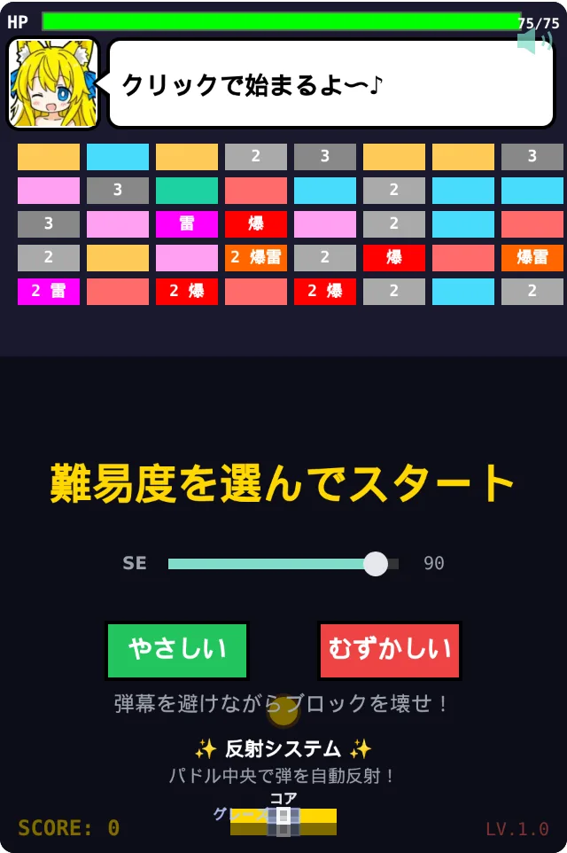
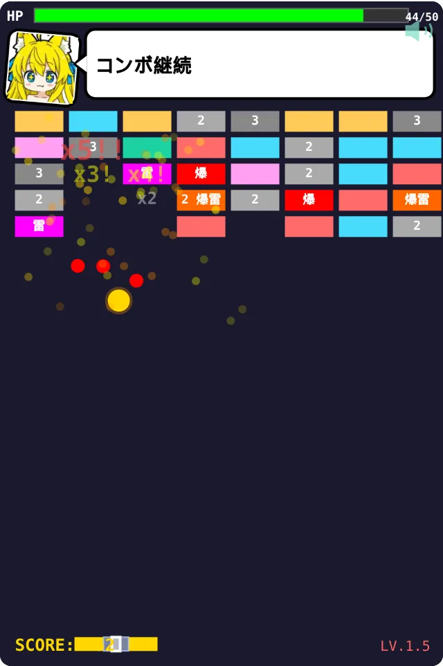
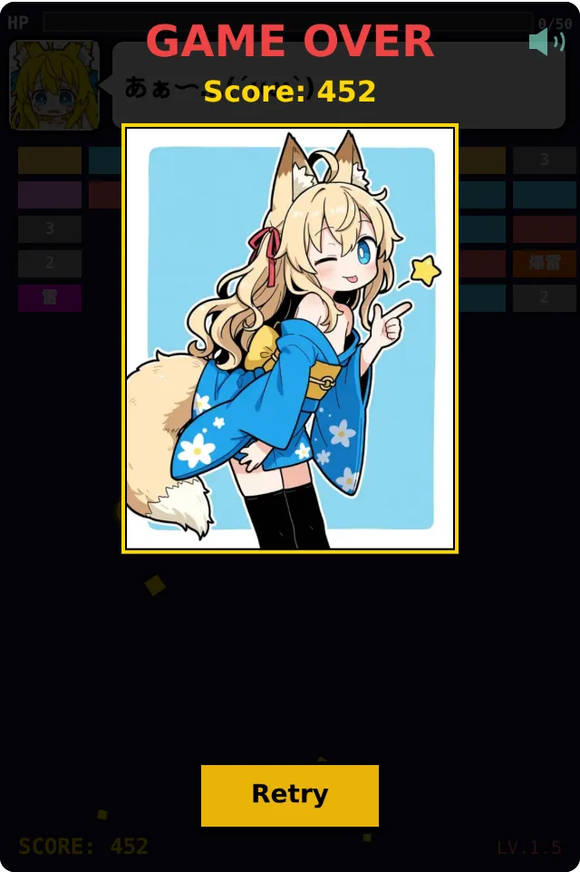

# breakout-engine

カスタマイズ可能なアセットを備えた、小さく依存の少ない HTML5 Canvas ブロック崩しゲームエンジン。

[](https://github.com/traponion/breakout-engine/actions/workflows/ci.yml)
[](./LICENSE)

[English](./README.md) | 日本語

> 現在プレイ可能：コアゲームと効果音は実装済み。BGM は今後のフォローアップで追加予定です。

| 準備画面                                   | プレイ中                                        | ゲームオーバー                                          |
| ------------------------------------------ | ----------------------------------------------- | ------------------------------------------------------- |
|  |  |  |

## 目指すもの

- **サーバ依存ゼロ。** すべてクライアントサイドで動作します。`index.html` を開くだけです。
- **その場でカスタマイズ。** `config.js` を編集し（再ビルド不要）、`assets/` 配下のファイルを差し替えるだけで、難易度・サウンド・言語・マスコット・リワード画像を変更できます。
- **軽く、読みやすく。** TypeScript ソース、最小限の devDependencies、フレームワークなし。

## 遊んでみる

`main` のビルドが成功すると、ライブデモが GitHub Pages に公開されます：

<https://traponion.github.io/breakout-engine/>

## ローカルで使う

```sh
npm ci
npm run dev
```

ブラウザで `http://localhost:8000` を開いてください。`config.js` を編集してリロードすると変更が反映されます。

## カスタマイズ

エンジンは実行時に `config.js` を読み込みます。デフォルト値はバンドルに含まれていますが、ビルドと一緒に配置されるこのファイルを編集することで、すべての値を上書きできます。

サンプルアセットは `assets/` 配下にあります。ファイルをその場で差し替えれば、独自のマスコット・リワードイラスト・効果音を使えます。アセットの命名規則は `DESIGN.md` を参照してください。

```js
// config.js
window.BREAKOUT_CONFIG = {
  difficulty: 'easy', // 'easy' | 'hard'
  bgmVolume: 80, // 0–100（予約済み。BGM は今後のビルドで追加）
  seVolume: 90, // 0–100 SE の初期音量（ゲーム内スライダーが優先されます）
  lang: 'ja', // 'ja' | 'en'
  showMascotComments: true,
  rewards: [
    { minScore: 0, src: 'assets/rewards/reward-001.webp' },
    { minScore: 3001, src: 'assets/rewards/reward-002.webp' },
    { minScore: 6001, src: 'assets/rewards/reward-003.webp' },
    { minScore: 9001, src: 'assets/rewards/reward-004.webp' },
  ],
  // 効果音の個別上書き。デフォルトは assets/sounds/se-<name>.mp3：
  // sounds: { paddleHit: 'assets/sounds/my-paddle-hit.mp3' },
};
```

## 開発する

コーディング規約と開発コマンドは `CLAUDE.md` を、アーキテクチャ・拡張ポイント・アセット規約は `DESIGN.md` を、ブランチポリシーと PR ワークフローは `CONTRIBUTING.md` を参照してください（いずれも英語）。

## ライセンス

- **ソースコード：MIT。** `LICENSE` を参照してください。
- **同梱サンプルコンテンツ：別条件。** `assets/LICENSE.txt` を参照してください。対象は `assets/` 配下のファイルと、`src/i18n/comments.ts` のサンプルセリフカタログです。要約すると：フォーク内での編集・差し替えは自由です。サンプルを単体のアセット集として再配布したり、派生プロダクトのデフォルトマスコットとして無改変のまま出荷したりしないでください。

あなた自身のマスコットを連れてきてください。そこが一番楽しいところです。
